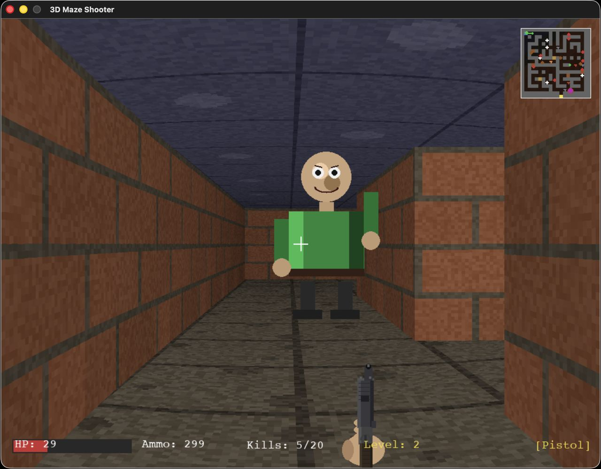
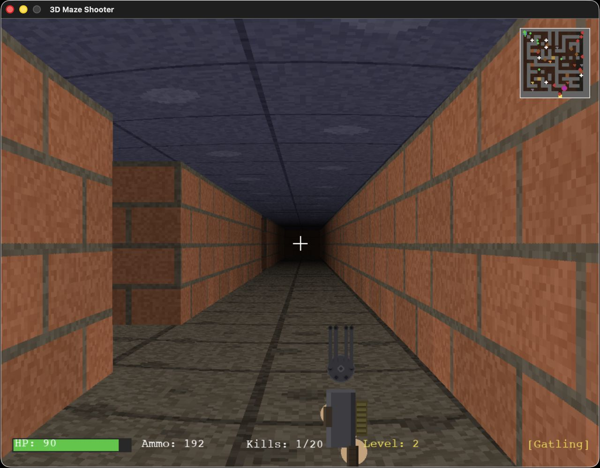
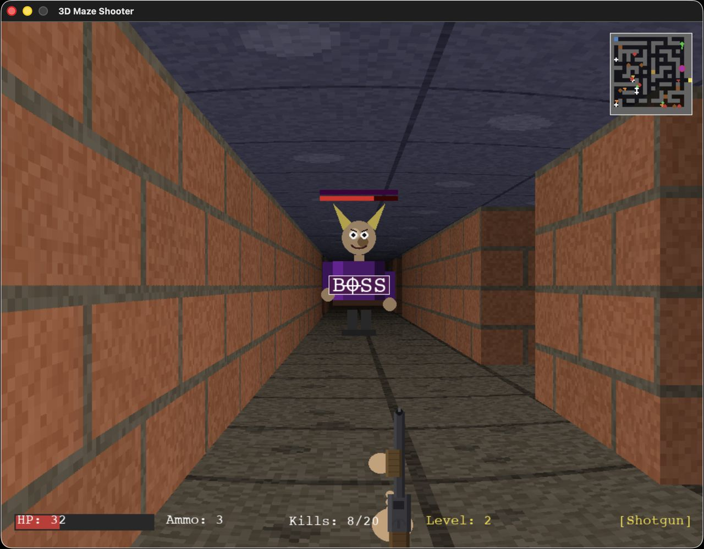

# 2.5D Maze Shooter

A retro first-person shooter built in Python with Pygame CE, using a from-scratch raycasting engine. **Every asset is procedurally generated at runtime** — no images, no audio files, no external dependencies beyond Pygame and NumPy.

## Screenshots

| | |
|---|---|
|  |  |
| Pistol facing a regular enemy | Gatling gun cruising the maze |


*Shotgun showdown with the level boss — note the boss HP bar overhead.*

## Features

- **Raycasting 3D engine** — textured walls, floors, and ceilings rendered one column at a time
- **Procedural everything** — all wall textures, sprites, and sound effects synthesized in code at startup
- **5 weapons** — pistol, shotgun, gatling gun, rocket launcher, and a screen-clearing nuke
- **4 enemy types** — regular grunts, fast scouts, ceiling spiders, and a level-end boss
- **Procedural level generation** — each level rewrites the maze, doors, and spawn points
- **Doors, jumping, sprinting, strafing**, and a live minimap
- **Fully typed** — passes `pyright` in strict mode

## Requirements

- Python 3.14+
- [Pygame CE](https://pyga.me/) and NumPy

```bash
python -m venv .venv
source .venv/bin/activate  # Windows: .venv\Scripts\activate
pip install -r requirements.txt
```

## Running

```bash
./run.sh
```

Or, with the venv activated:

```bash
python shooter.py
# or, equivalently
python -m shooter
```

## Controls

| Action | Keys |
|---|---|
| Move forward / back | `W` / `S` (or `↑` / `↓`) |
| Strafe left / right | `A` / `D` |
| Turn | Mouse, or `←` / `→` |
| Sprint | `Shift` |
| Jump | `Space` |
| Open door | `E` |
| Fire | Left mouse button |
| Pistol / Shotgun / Gatling / Rockets | `1` / `2` / `3` / `4` |
| Nuke | `0` |
| Restart (on death) | `R` |
| Quit | `Esc` |

## Project Layout

```
shooter.py              Entry point
shooter/
├── constants.py        Display, audio, and game-balance tuning values
├── types.py            Shared type aliases
├── map.py              Maze grid, spatial queries, level generation
├── sound.py            Procedural sound synthesis
├── textures.py         Procedural texture generation
├── entities.py         Enemies, pickups, rockets, hitscan
├── raycaster.py        Ray casting engine
├── render_world.py     Floor, ceiling, and wall rendering
├── render_sprites.py   Billboarded sprites and effects
├── render_ui.py        Minimap, crosshair, HUD
├── weapons.py          First-person weapon viewmodels
└── game.py             GameState and main loop
```

All mutable state lives in a single `GameState` object. The main loop is split into focused update functions (`update_player`, `update_combat`, `update_doors`, `update_enemies`, `update_pickups`, `update_rockets`, `check_win_lose`) so each behavior can be located and modified independently. Game balance — player physics, weapon stats, spawn counts, timing — is all in `shooter/constants.py`.

## Type Checking

```bash
pyright
```

Configuration lives in `pyrightconfig.json`; the codebase passes strict mode.

## License

Released into the public domain under [The Unlicense](LICENSE). Do whatever you want with it.